# Caligari Studio
Caligari Studio es una aplicación que te permite tocar los instrumentos: guitarra, piano, xilófono y flauta.

Su nombre  es en honor al grupo de rock español Gabinete Caligari.
La aplicación está hecha en python con la tecnología de GUI kivy y liberías comp pydub o playsound, entre otras.

## Vistas
**Vista de piano:**
En el piano se pueden escoger las octavas y el estilo (o sonido) de las teclas a travás del menú desplegable. También se puede escoger si se desea el tono más grave o más agudo.

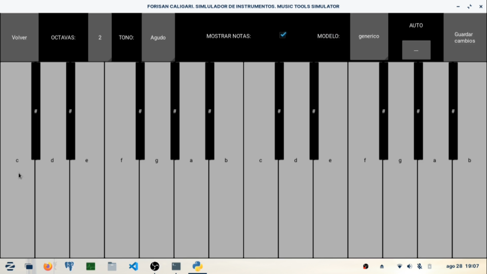
2 octavas.

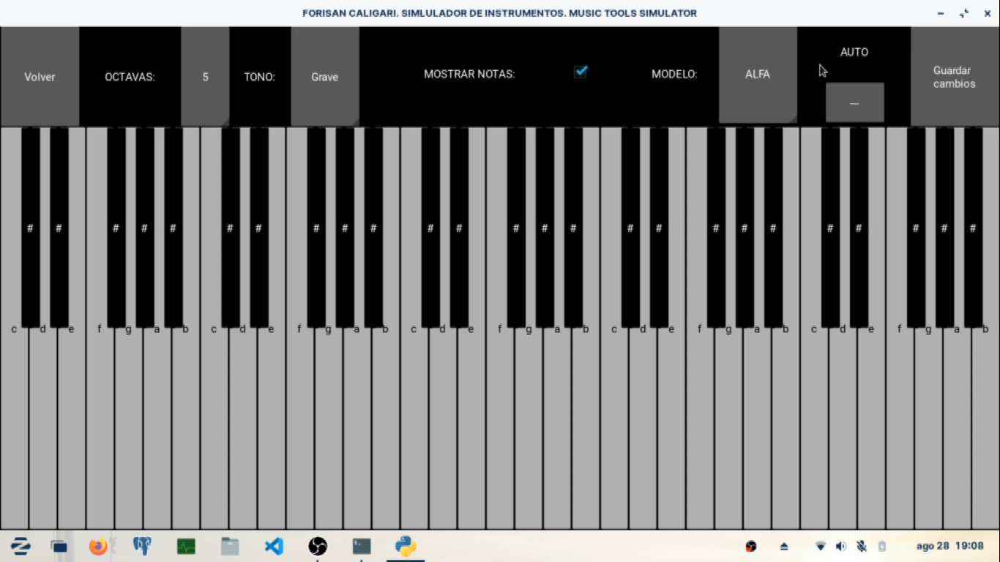
5 octavas.

**Vista de guitarra:**
Se pueden escoger dos tipos distintos de sonidos, y también elegir si tocar con plantilla.

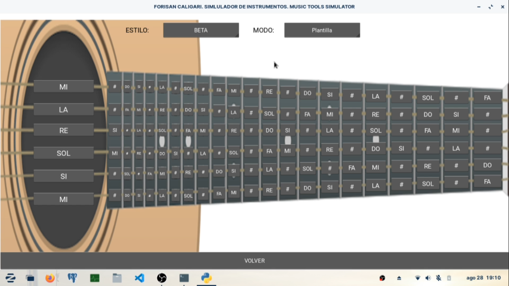
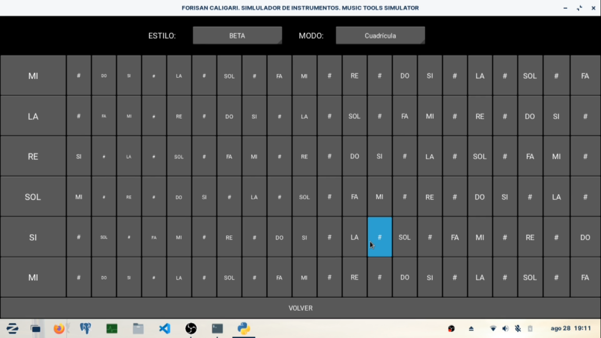

**Vista de xilófono:**
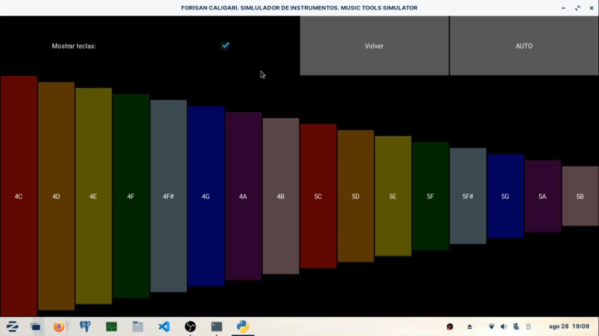

**Vista de flauta:**
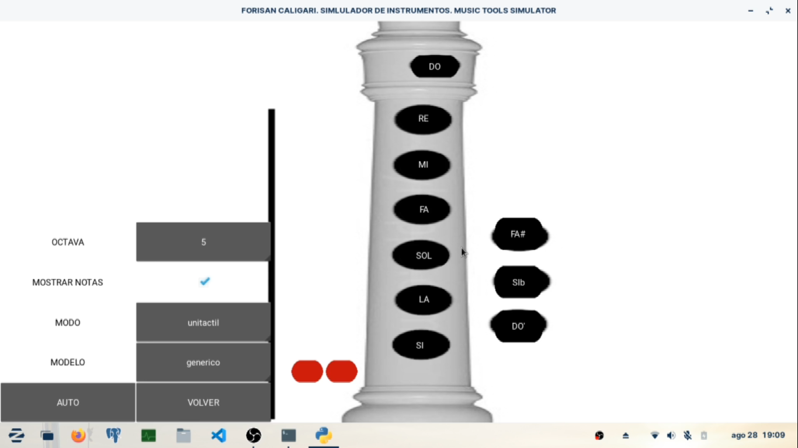

**Panel principal**
Desde el panel principal se puede escoger el instrumento a tocar
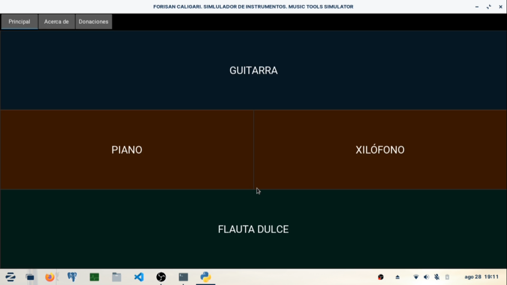

**Reproducción de melodías:**
También se pueden elaborar melodías mediante un lenguaje propio inventado a través de expresiones regulares. Permite reproducir melodías de forma automatizada.
Pues el usuario escoge el tiempo de cada nota y su tono.
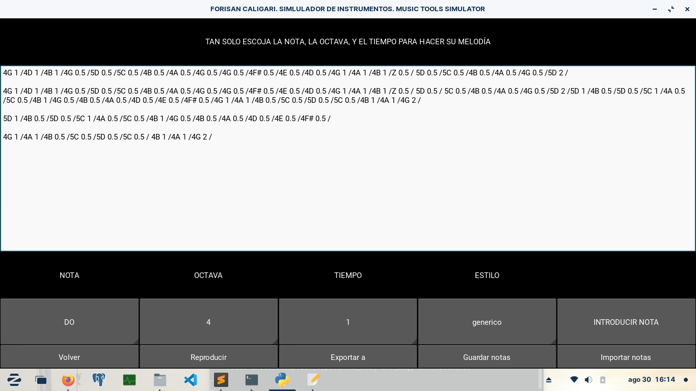

## Vídeos de demostración:
**Instrumentos tocados de forma individual.**
[Ver video](vid/1.mp4)

**Melodía automatizada**
Esta melodía corresponde a la marcha granadera.
[Ver video](vid/2.mp4)

## Muestras de código:

**Xilófono**
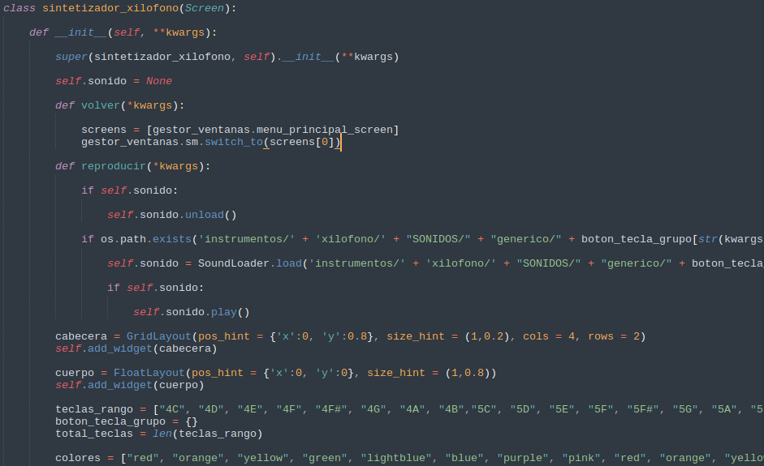

**Guitarra**
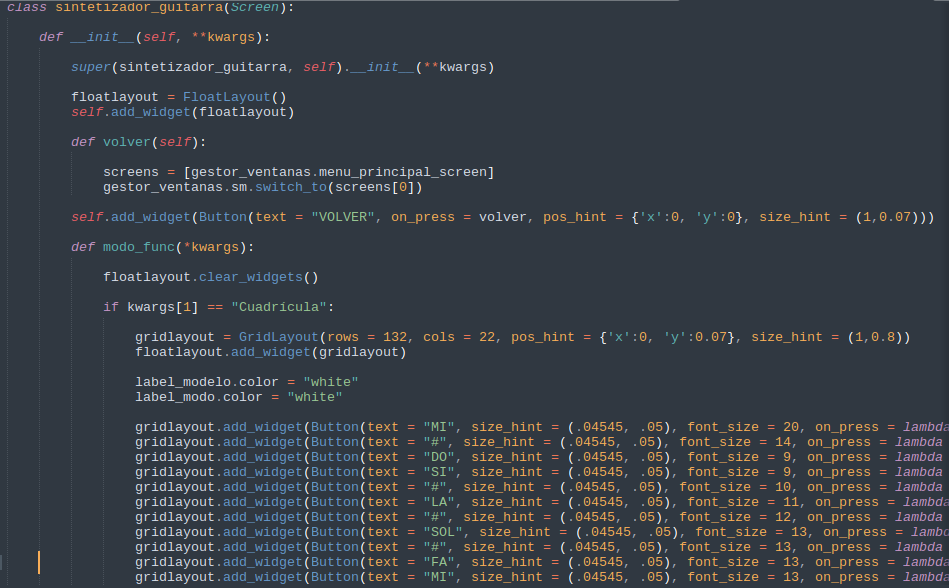

**Menú principal**
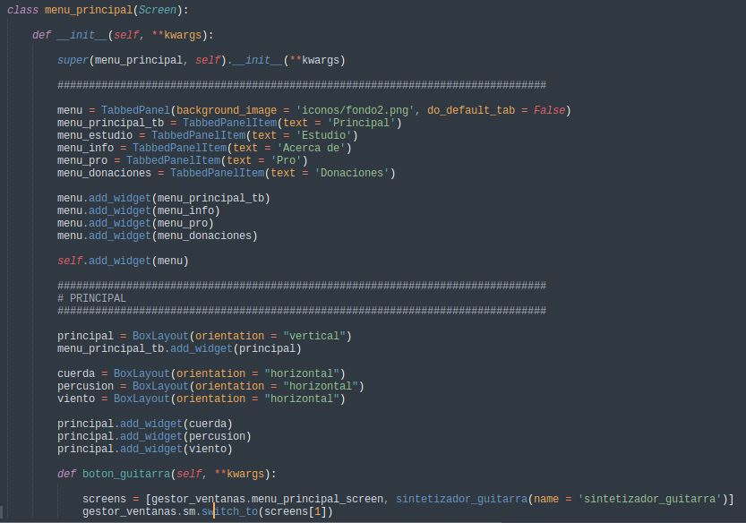

**Melodías automáticas**
Como puede ver se usa el módulo re para construir las expresiones regulares e identíficar cada
nota separa por /
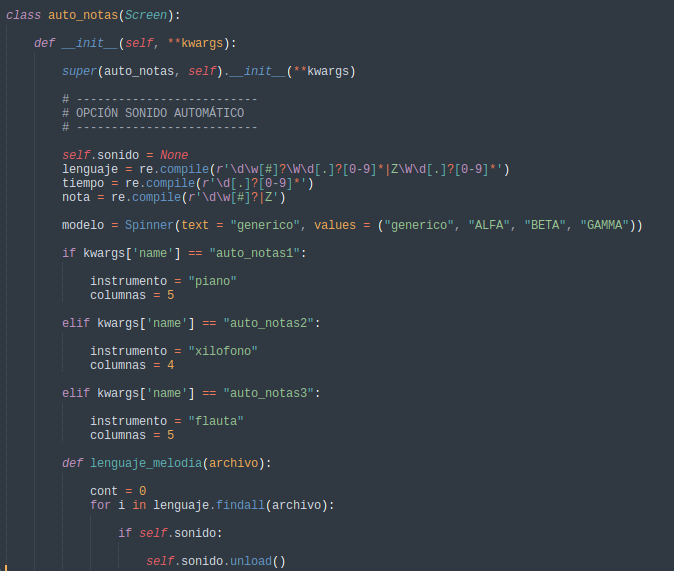
